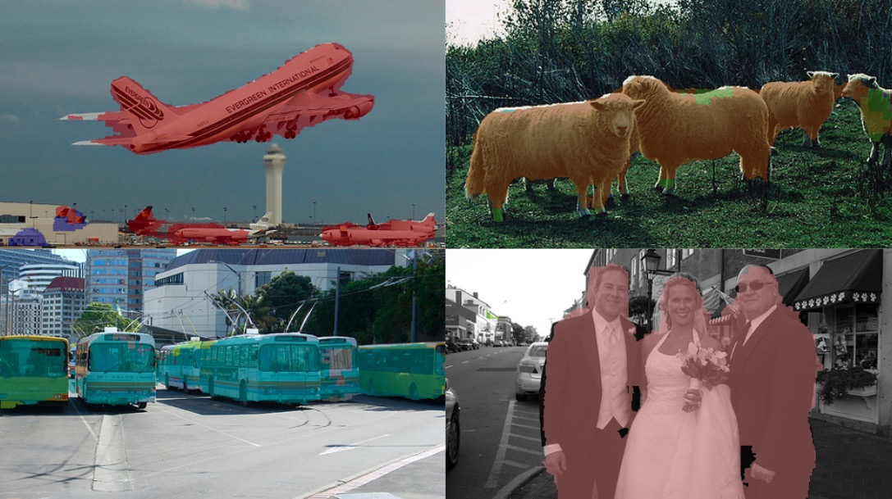
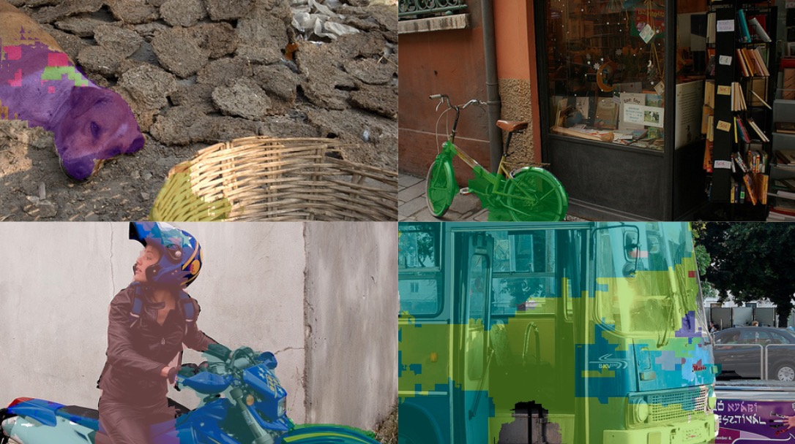
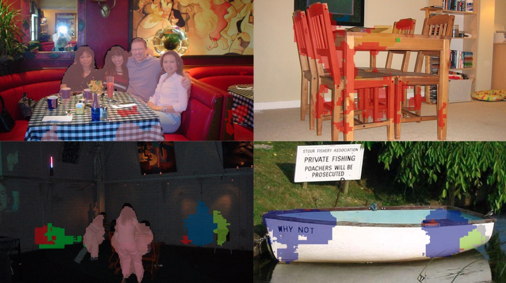

# voc_fcn
Fully Convolutional Network trained on Pascal Visual Object Classes dataset. 
This work provides a tensorflow (version 1.8) implementation of "Fully Convolutional Networks for Semantic Segmentation" paper.   
There are some differences between this implementation and original paper - model is not trained in stages, and dense layers from VGG model are not used.

## Entry points
There are three main entry points in this project:  
- scripts/train.py - for training the model  
- scripts/analysis.py - for checking model's performance  
- scripts/visualize.py - contains a number of functions for visualizing dataset and predictions  
All scripts require path to configuration file as argument. **configuration.yaml** provides a sample configuration, as described in **configuration** section.

## Dataset
Following original paper, this project uses two datasets: [VOC2012 PASCAL] (http://host.robots.ox.ac.uk/pascal/VOC/voc2012) dataset and Hariharan's [extended VOC2011 PASCAL dataset](http://home.bharathh.info/pubs/codes/SBD/download.html). Note you will need to download train_noval.txt for Hariharan's set separately from dataset's page.

## Configuration
Paths to datasets, training hyperparameters, logging path, and many other settings are controlled through a configuration file. **configuration.yaml** provides a sample implementation.

## Results
We present three sets of images to show some of the best results, average results and failure cases.

#### Good results

#### Average results

#### Failures

Mean intersection over union of the best trained model for the validation dataset was **0.429**, with performance on each category provided in table below.

Category | Intersection over union
--- | --- 
aeroplane | 0.57915
background | 0.85575
bicycle | 0.19839
bird | 0.43495
boat | 0.26772
bottle | 0.32754
bus | 0.61916
car | 0.57225
cat | 0.59068
chair | 0.15615
cow | 0.28003
diningtable | 0.27586
dog | 0.49675
horse | 0.37392
motorbike | 0.50737
person | 0.64846
pottedplant | 0.25426
sheep | 0.40522
sofa | 0.26697
train | 0.51445
tvmonitor | 0.37658
